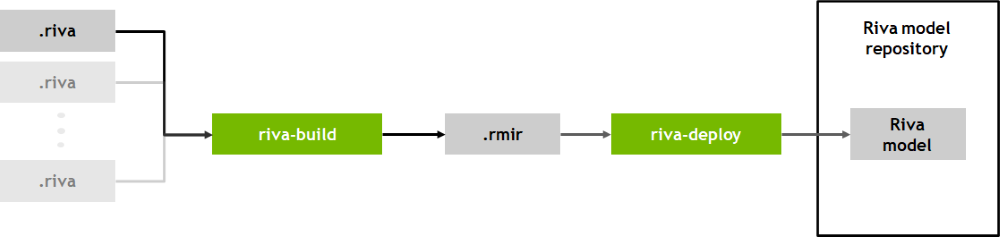

Riva - Speech Recognition - Deploy ASR Model
============================================

Riva ServiceMaker will be used to deploy ASR :code:`.riva` models in Riva server.

.. note::

	Refer to :ref:`riva_service_maker` to see basic usage of :code:`riva-build` and :code:`riva-deploy`.

riva-build
----------
Simple :code:`riva-build` pipeline for speech recognition (ASR) models. See `ASR model pipeline configuration <https://docs.nvidia.com/deeplearning/riva/user-guide/docs/service-asr.html#pipeline-configuration>`_ for more details.

.. code-block:: bash

	riva-build speech_recognition \
		/servicemaker-dev/<rmir_filename>:<encryption_key>  \
		/servicemaker-dev/<riva_filename>:<encryption_key> \
		--name=<pipeline_name> \
		--decoder_type=greedy \
		--acoustic_model_name=<acoustic_model_name>

* :code:`speech_recognition`: task of :code:`riva-build`. See :ref:`riva_service_maker` for more details.

Sample :code:`riva-build` tool usage for ASR models.

.. code-block:: bash

	docker run --rm --gpus 1 \
		-v $MODEL_LOC:/tao \
		-v $RMIR_LOC:/riva \
		$RIVA_SM_CONTAINER -- \
		riva-build speech_recognition --decoder_type=greedy /riva/asr.rmir:$KEY /tao/$MODEL_NAME:$KEY

where

* :code:`MODEL_LOC`: path of directory exported :code:`.riva` model
* :code:`RMIR_LOC`: path of output :code:`.rmir` file
* :code:`RIVA_SM_CONTAINER`: name of Riva ServiceMaker image.
* :code:`MODEL_NAME`: name of exported :code:`.riva` model
* :code:`KEY`: encryption_key used in exporting :code:`.riva` model.

riva-deploy
-----------

Sample :code:`riva-deploy` tool usage for ASR models.

.. code-block:: bash

	docker run --rm --gpus 1 \
		-v $RIVA_MODEL_LOC:/data \
		$RIVA_SM_CONTAINER -- \
		riva-deploy -f  /data/rmir/asr.rmir:$KEY /data/models/

where

* :code:`RIVA_MODEL_LOC`: path of Riva model repository.