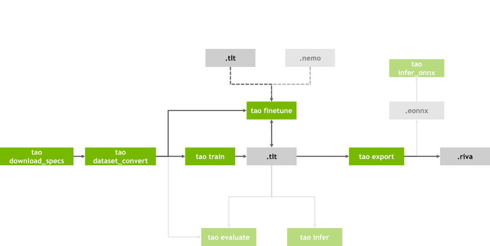
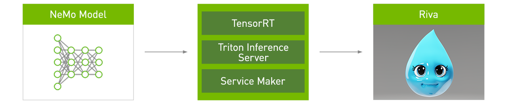

.. _riva_custom_model_intro:

Riva - Custom Model
===================

To train, export AI models, and then deploy the models in Riva server, we will use NVIDIA TAO and NVIDIA NeMo. Both training frameworks enable the transformation of custom models into :file:`.riva` models that can be deployed in Riva.

TAO
---

NeMo
----

Export models
-------------
The exported models in :file:`.riva` format can be deployed in Riva with Riva ServiceMaker.

.. note::

    See :ref:`riva_service_maker` to deploy TAO- or NeMo-trained models.

.. seealso::

    * `NeMo guide <https://docs.nvidia.com/deeplearning/nemo/user-guide/docs/en/v1.2.0/starthere/intro.html>`_

    * `NeMo Tutorials <https://docs.nvidia.com/deeplearning/nemo/user-guide/docs/en/main/starthere/tutorials.html>`_
