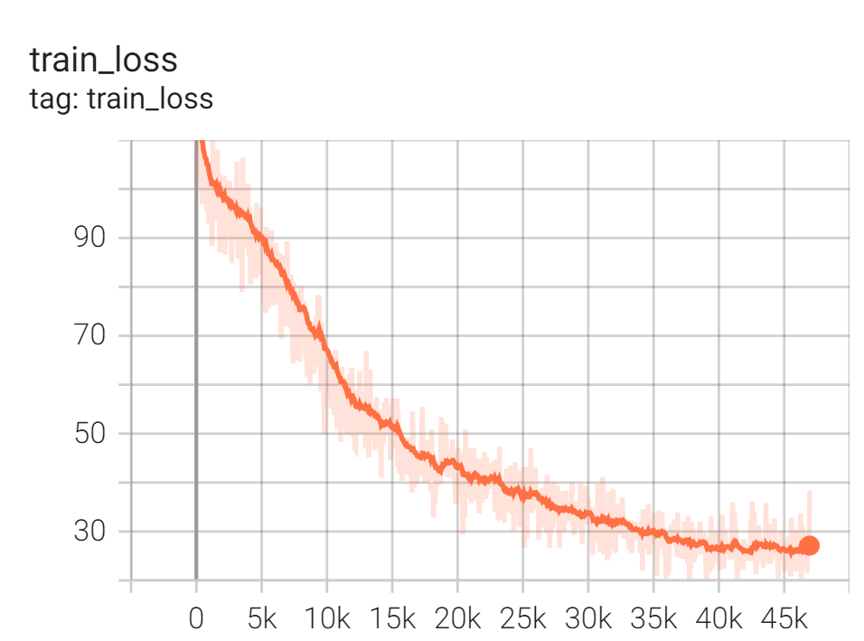
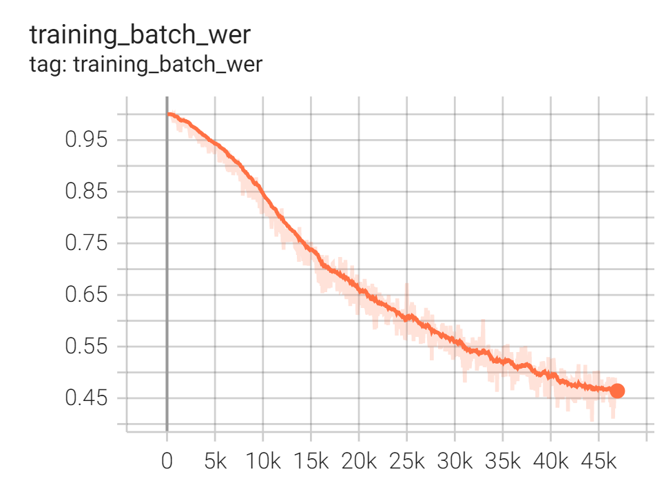
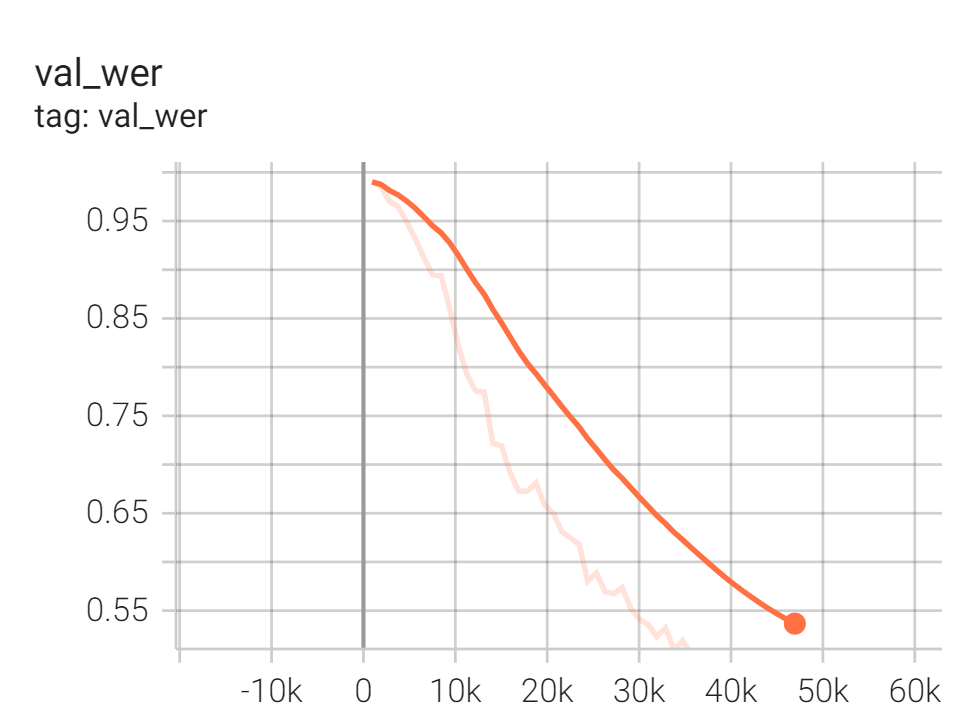

Riva - Custom Model - NeMo - ASR - Mandarin
===========================================

This sample implements ASR of Mandarin using Nemo.

0. Launch PyTorch container with NeMo
-------------------------------------

Follow :ref:`nemo_getting_started` to set up container for the sample ASR Mandarin implementation.

Then start a jupyter notebook inside the container

.. code-block:: bash

    jupyter notebook --ip=0.0.0.0 --allow-root

Access the jupyter notebook by the URI *http://<your-host-ip>:8888/tree*. Create a notebook, and so you are ready for next step.

1. Prepare data manifest
------------------------

1.1 Download Aishell-1 dataset
~~~~~~~~~~~~~~~~~~~~~~~~~~~~~~

Download AISHELL-1 dataset from Openslr. AISHELL-1 dataset is an open-sourced dataset contaning 178 hours of Mandarin utterances.

.. code-block:: bash

    !wget https://www.openslr.org/resources/33/data_aishell.tgz
    !tar zxvf data_aishell.tgz

Retrieve the audio files

.. code-block:: python

    import os
    import tarfile
    import shutil
    from tqdm import tqdm
        
    remove manifests if already exists
    os.chdir("/NeMo/data_aishell/wav")
    if delete_previous:
        shutil.rmtree("train")
        shutil.rmtree("test")
        shutil.rmtree("dev")

    untar the audio files if you have not done this
        wav_tars = os.listdir(os.getcwd())
        for wav_tar in tqdm(wav_tars):
            current_tar = os.path.join(os.getcwd(), wav_tar)
            tar = tarfile.open(current_tar)
            tar.extractall('.')
            tar.close()

1.2 Build data manifest
~~~~~~~~~~~~~~~~~~~~~~~

Data manifest are files containing all metadata of audio required by NeMo.

.. code-block:: python

    import librosa
    import json

    def build_aishell_manifest(transcript_path, manifest_path, wav_path):
        with open(transcript_path, "r") as fin:
            with open(manifest_path, "w") as fout:
                    
                transcript = fin.readlines()
                
                for ref in tqdm(transcript):
                    s_num = ref[6:11]
                    text = ref[11 + 5:].strip()
                    audio_file = "BAC009" + ref[6:16] + ".wav"
                    audio_path = os.path.join(wav_path, s_num, audio_file)
                    
                    if os.path.exists(audio_path):
                        
                        duration = librosa.core.get_duration(filename=audio_path)

                        metadata = {
                            "audio_filepath": audio_path,
                            "duration": duration,
                            "text": text
                        }
                        
                        json.dump(metadata, fout, ensure_ascii=False)
                        fout.write('\n')
                        
            
    # build training manifest
    print("building training manifest")
    transcript_path = "/NeMo/data_aishell/transcript/aishell_transcript_v0.8.txt"
    train_manifest_path = "/NeMo/data_aishell/train_manifest.json"
    train_wav_path = "/NeMo/data_aishell/wav/train"
    build_aishell_manifest(transcript_path, train_manifest_path, train_wav_path)
    print("training manifest prepared at {}".format(train_manifest_path))

    # build validation manifest
    print("\nbuilding validation manifest")
    transcript_path = "/NeMo/data_aishell/transcript/aishell_transcript_v0.8.txt"
    valid_manifest_path = "/NeMo/data_aishell/valid_manifest.json"
    valid_wav_path = "/NeMo/data_aishell/wav/test"
    build_aishell_manifest(transcript_path, valid_manifest_path, valid_wav_path)
    print("training manifest prepared at {}".format(valid_manifest_path))

    # build testing manifest
    print("\nbuilding testing manifest")
    transcript_path = "/NeMo/data_aishell/transcript/aishell_transcript_v0.8.txt"
    test_manifest_path = "/NeMo/data_aishell/test_manifest.json"
    test_wav_path = "/NeMo/data_aishell/wav/dev"
    build_aishell_manifest(transcript_path, test_manifest_path, test_wav_path)
    print("testing manifest prepared at {}".format(test_manifest_path))

.. seealso::

    see :ref:`nemo_data_manifest` for more about manifest formatting.

2. Prepare training configuration
---------------------------------

2.1 Load QuartzNet 15x5 zh default config
~~~~~~~~~~~~~~~~~~~~~~~~~~~~~~~~~~~~~~~~~

The model we are using to train with Aishell-1 is QuartzNet 15x5 zh. We could start with a default config file :file:`quartznet_15x5_zh.yaml` at :file:`/NeMo/examples/asr/conf/quartznet/`.

.. code-block:: python

    from omegaconf import OmegaConf
    import copy

    try:
        from ruamel.yaml import YAML
    except ModuleNotFoundError:
        from ruamel_yaml import YAML

    config_path = "/NeMo/examples/asr/conf/quartznet/quartznet_15x5_zh.yaml"

    yaml = YAML(typ='safe')
    with open(config_path) as f:
        zh_qn_params = yaml.load(f)
        
    print(OmegaConf.to_yaml(zh_qn_params))

.. note::

    The config file is very lengthy as it contains Chinese lexicons.

2.2 Update manifest path
~~~~~~~~~~~~~~~~~~~~~~~~

Update the path to data manifests that we just created

.. code-block:: python

    zh_qn_params["model"]["train_ds"]["manifest_filepath"] = train_manifest_path
    zh_qn_params["model"]["validation_ds"]["manifest_filepath"] = valid_manifest_path

2.3 Update num_workers
~~~~~~~~~~~~~~~~~~~~~~

Update num_workers of data loaders

.. code-block:: python

    num_workers = 40
    zh_qn_params["model"]["train_ds"]["num_workers"] = num_workers
    zh_qn_params["model"]["validation_ds"]["num_workers"] = num_workers

2.4 Update logging directory
~~~~~~~~~~~~~~~~~~~~~~~~~~~~

We will create a results folder :file:`/NeMo/data_aishell/results` where our training logs and output :file:`.nemo` model will be stored.

.. code-block:: bash

    !mkdir data_aishell/results

Update the results path in the configuration.

.. code-block:: python

    results_path = "/NeMo/data_aishell/results"
    zh_qn_params["exp_manager"]["exp_dir"] = results_path

3. Train QuartzNet 15x5 zh
--------------------------

After the configuration is ready, we move on to model training session. Define :code:`pytorch_lightning.Trainer` and :code:`nemo_asr.models.EncDecCTCModel` instances:

.. code-block:: python

    from omegaconf import DictConfig
    import pytorch_lightning as pl
    import nemo
    import nemo.collections.asr as nemo_asr

    trainer = pl.Trainer(checkpoint_callback=False, logger=False, gpus=4, max_epochs=50, accelerator="ddp")

    zh_qn = nemo_asr.models.EncDecCTCModel(cfg=DictConfig(zh_qn_params['model']), trainer=trainer)

Also, we apply :code:`exp_manager` to apply the logging path of training.

.. code-block:: python

    from nemo.utils.exp_manager import exp_manager
    exp_manager(trainer, zh_qn_params.get("exp_manager", None))

However, :code:`pl.Trainer` using an accelerator :code:`ddp` cannot be done in interactive environment (notebook).

.. warning::

    If you attempt to use :code:`ddp` in the notebook, you will be likely warned:

    .. code-block::

        AttributeError: Can't pickle local object 'FilterbankFeatures.__init__.<locals>.<lambda>'

Thus, let's create a python script :file:`main.py` to start the training and save our result :file:`model.nemo`. To do so, go to jupyter notebook menu, open a terminal, create :file:`main.py`, and paste the following script.

.. code-block:: python

    import librosa
    import json
    from omegaconf import OmegaConf
    import copy
    from omegaconf import DictConfig
    import pytorch_lightning as pl
    import nemo
    import nemo.collections.asr as nemo_asr
    from nemo.utils.exp_manager import exp_manager
    try:
        from ruamel.yaml import YAML
    except ModuleNotFoundError:
        from ruamel_yaml import YAML

    def main():
        # set manifest path
        train_manifest_path = "/NeMo/data_aishell/train_manifest.json"
        valid_manifest_path = "/NeMo/data_aishell/valid_manifest.json"

        # load QuartzNet 15x5 zh default config
        config_path = "/NeMo/examples/asr/conf/quartznet/quartznet_15x5_zh.yaml"
        yaml = YAML(typ='safe')
        with open(config_path) as f:
            zh_qn_params = yaml.load(f)

        # update manifest path
        zh_qn_params["model"]["train_ds"]["manifest_filepath"] = train_manifest_path
        zh_qn_params["model"]["validation_ds"]["manifest_filepath"] = valid_manifest_path

        # update num_workers
        num_workers = 40
        zh_qn_params["model"]["train_ds"]["num_workers"] = num_workers
        zh_qn_params["model"]["validation_ds"]["num_workers"] = num_workers

        # update training logs path
        results_path = "/NeMo/data_aishell/results"
        zh_qn_params["exp_manager"]["exp_dir"] = results_path

        # Initialise trainer
        trainer = pl.Trainer(checkpoint_callback=False, logger=False, gpus=4, max_epochs=50, accelerator="ddp")
        zh_qn = nemo_asr.models.EncDecCTCModel(cfg=DictConfig(zh_qn_params['model']), trainer=trainer)

        # training logs export
        exp_manager(trainer, zh_qn_params.get("exp_manager", None))

        # Start training
        zh_qn.summarize()
        trainer.fit(zh_qn)

        # Save trained model
        zh_qn.save_to("/NeMo/data_aishell/results/model.nemo")

    if __name__ == '__main__':
        main()

Then, in the terminal, execute :file:`main.py` to start the training process

.. code-block:: bash

    python3 main.py

4. Visualise Training Progress
------------------------------

The training logs are saved at :file:`/NeMo/data_aishell/results/QuartzNet15x5`, and we use TensorBoard for visualisation using a custom Python environment with TensorBoard installed.

Create a python environment

.. code-block:: bash

    python3 -m venv venv

Install tensorboard

.. code-block:: bash

    pip install tensorboard

Launch tensorboard

.. code-block:: bash

    cd /NeMo/data_aishell/results/
    tensorboard --bind_all --logdir QuartzNet15x5

.. warning::

    If you use tensorboard that comes with NeMo package install script :file:`reinstall.sh` (as of Sep 2021), that is:

    .. code-block:: bash

        tensorboard --bind_all --logdir QuartzNet15x5/

    you will meet the following error:

    .. code-block::

        ValueError: Duplicate plugins for name projector

Training loss
~~~~~~~~~~~~~

Training batch WER
~~~~~~~~~~~~~~~~~~

Validation WER
~~~~~~~~~~~~~~

