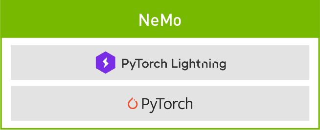
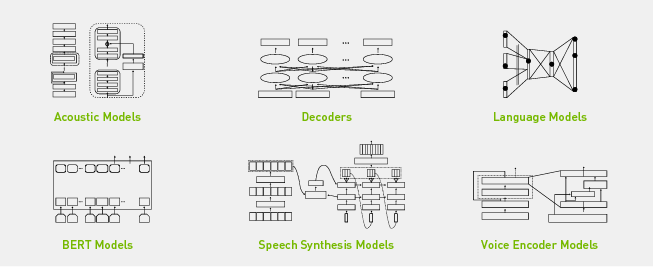

Riva - Custom Model - NeMo
==========================

NVIDIA NeMo (Neural Module) is built on PyTorch and PyTorch lightning.

Prerequisites
-------------

* NGC API Key

.. _nemo_getting_started:

Getting started
---------------

1. Clone NVIDIA NeMo Github folder

.. code-block:: bash

    git clone https://github.com/NVIDIA/NeMo

2. Create PyTorch container

.. code-block:: bash

    docker run --gpus all -it --rm -v <nemo_github_folder>:/NeMo --shm-size=8g \
    -p 8888:8888 -p 6006:6006 --ulimit memlock=-1 --ulimit \
    stack=67108864 --device=/dev/snd nvcr.io/nvidia/pytorch:21.05-py3

3. Install NeMo

.. code-block:: bash

     ./reinstall.sh 

.. seealso::

    * `NeMo Tutorials <https://docs.nvidia.com/deeplearning/nemo/user-guide/docs/en/v1.3.0/starthere/tutorials.html>`_
    * `ASR with NeMo <https://github.com/NVIDIA/NeMo/blob/main/tutorials/asr/ASR_with_NeMo.ipynb>`_