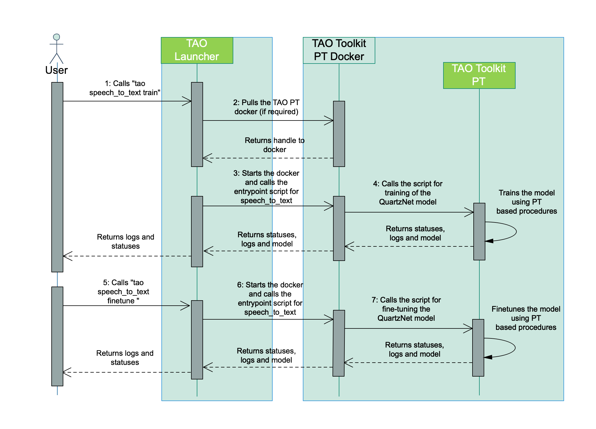

Riva - Custom Model - TAO - speech-to-text
==========================================

Usage
-----
The structure used to perform :code:`speech_to_text` task

.. code-block:: bash

    tao speech_to_text <subtask>

.. _stt_subtask:

Subtasks
~~~~~~~~

The subtasks for :code:`speech_to_text` include *dataset_convert, evaluate, export, finetune, infer, infer_onnx, train, download_specs*

Sample task *download_specs*

.. code-block:: bash

    !tao speech_to_text download_specs \
        -o $SPECS_DIR/speech_to_text \
        -r $RESULTS_DIR

Sample task *export*

.. code-block:: bash

    # SPECS_DIR/speech_to_text/export.yaml
    # Name of the .tlt EFF archive to be loaded/model to be exported.
    restore_from: trained-model.tlt

    # Set export format: ONNX | RIVA
    export_format: RIVA

    # Output EFF archive containing ONNX.
    export_to: exported-model.riva

.. code-block:: bash

    !tao speech_to_text export \
        -r $RESULTS_DIR/quartznet/export \
        -k $KEY \
        -e $SPECS_DIR/speech_to_text/export.yaml \
        -g 1 \
        -m $MODELS_DIR/speechtotext_english_quartznet.tlt \
        export_format=RIVA \
        export_to=asr-model.riva

Arguments
~~~~~~~~~

.. list-table:: TAO speech-to-text task arguments
    :widths: 25 105
    :header-rows: 1

    * - Arguments
      - Details
    * - subtask
      - choose the task from :ref:`stt_subtask`
    * - :code:`-r`
      - path of results directory
    * - :code:`-k`
      - your NGC API key
    * - :code:`-e`
      - spec file of a specific subtask
    * - :code:`-g`
      - number of gpu to use
    * - :code:`-m`
      - path of pretrained ASR model
    * - :code:`-o`
      - specify path for downloading spec files
    * - additional arguments
      - override values in spec file
 