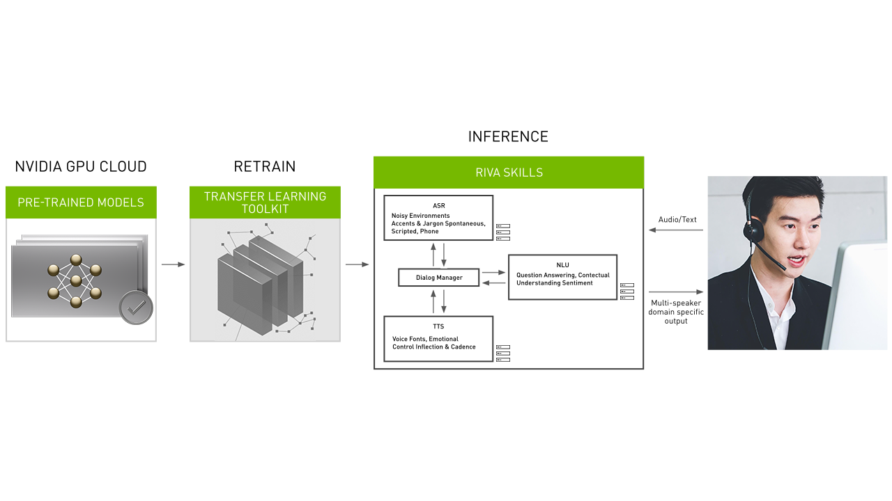

.. _riva_start_guide:

Riva - Getting Started
======================

*NVIDIA Riva* is a GPU-accelerated SDKs which we can use to build conversational AI applications using deep learning. Riva platform offers power features including

1. Complete set of tools to build conversational AI combining services of speech recognition (ASR), Natural Language Understanding/Processing (NLU/NLP), and text speech_synthesis (TTS)
2. Complete workflow to build, train, and deploy models in Riva using NVIDIA TAO, NVIDIA NeMo.
3. Optimised deployed models to deliver greater performance and latency.
4. Client integration using gRPC API

Prerequisites
-------------

.. note::

	Follow below to launch Riva server.

1. follow `CLI Install Guide <https://ngc.nvidia.com/setup/installers/cli>`_ to set up NGC Catalog API

2. Download Riva quick start scripts

.. code-block:: bash

	ngc registry resource download-version "nvidia/riva/riva_quickstart:1.5.0-beta"

3. Initialise and start Riva

.. code-block:: bash

	cd riva_quickstart_v1.5.0-beta
	bash riva_init.sh
	bash riva_start.sh

If :code:`bash riva_start.sh` was successfully executed, we will see

.. code-block::

	Waiting for Riva server to load all models...retrying in 10 seconds
	Waiting for Riva server to load all models...retrying in 10 seconds
	Waiting for Riva server to load all models...retrying in 10 seconds
	Riva server is ready...

That's it! Riva server is set up.

.. hint::

	For checking Riva Available services, run :code:`docker logs riva-speech`, and you should see output similar to below outputs:

	.. code-block::

		+------------------------------------------------+---------+--------+
		| Model                                          | Version | Status |
		+------------------------------------------------+---------+--------+
		| riva-asr                                       | 1       | READY  |
		| riva-asr-ctc-decoder-cpu-streaming             | 1       | READY  |
		| riva-asr-feature-extractor-streaming           | 1       | READY  |
		| riva-asr-voice-activity-detector-ctc-streaming | 1       | READY  |
		| riva-trt-riva-asr-am-streaming                 | 1       | READY  |
		+------------------------------------------------+---------+--------+

.. note::

	Configurations of Riva Server (e.g. models, services, ports) can be configured in  :code:`config.sh`. See :ref:`riva_config` for more details.

To stop running Riva server, run

.. code-block:: bash

	bash riva_stop.sh

Sample service usage
--------------------

You might start a container with sample clients for each service

.. code-block:: bash

	bash riva_start_client.sh

Try different services using provided notebooks

.. code-block:: bash

	jupyter notebook --ip=0.0.0.0 --allow-root --notebook-dir=/work/notebooks

.. seealso::

   * `NVIDIA Riva documentation <https://docs.nvidia.com/deeplearning/riva/user-guide/docs/index.html>`_

   * `Stanford CS224N: NLP with Deep Learning <https://www.youtube.com/watch?v=8rXD5-xhemo&list=PLoROMvodv4rOhcuXMZkNm7j3fVwBBY42z>`_