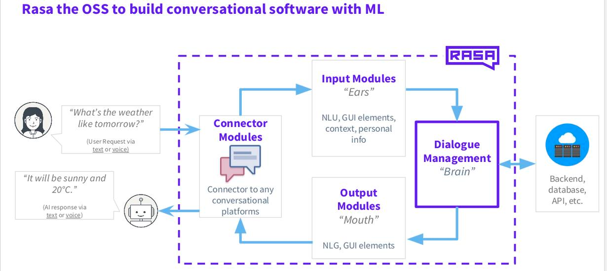

Riva - Rasa
===========

Prerequisites
-------------

Create and activate a virtual environment for Rasa

.. code-block:: bash 

    python3 -m venv rasa_envs
    source rasa_envs/bin/activate

Download rasa open source

.. code-block:: bash

    pip install rasa

Sample Chatbot
--------------

Activate the rasa environment, and run

.. code-block::

    rasa init

Follow the instructions to create sample chatbot directory, train models, start Rasa server, and start chatting with the chatbot.

Simply type in :code:`/stop` or :code:`Ctrl+C` to exit the Rasa server.

.. note::

    * To start Rasa server in shell, run :code:`rasa shell`
    * To interact with Rasa Chatbot for improving its correctness on responses or predictions, run :code:`rasa interactive`. Hit :code:`Ctrl+C` to end the interactive session, and you might export the new data for :code:`nlu.yml`, :code:`domains.yml`, and :code:`stories.yml`

Chatbot structure
~~~~~~~~~~~~~~~~~

.. code-block::

    .
    ├── actions
    │   ├── __init__.py
    │   ├── __pycache__
    │   │   ├── __init__.cpython-38.pyc
    │   │   └── actions.cpython-38.pyc
    │   └── actions.py
    ├── config.yml
    ├── credentials.yml
    ├── data
    │   ├── nlu.yml
    │   ├── rules.yml
    │   └── stories.yml
    ├── domain.yml
    ├── endpoints.yml
    ├── models
    │   └── 20210909-224920.tar.gz
    └── tests
        └── test_stories.yml

.. seealso::

    Useful learning sources:

    * `Rasa for beginners <https://info.rasa.com/cs/c/?cta_guid=0982be57-3dc2-4c94-a42a-f9dafb9fc4fb&signature=AAH58kEwU8tnosyts7EdOqB9LgR5ui9zQQ&pageId=34205535651&placement_guid=5c3bd6f6-b81d-479d-bef9-702cd0a41bc7&click=8a9645b9-a9f6-4735-93cb-3b713fcd72e0&hsutk=8c0834c152e81ccaf01fad29e5c7fa55&canon=https%3A%2F%2Finfo.rasa.com%2Frasa-courses&portal_id=6711345&redirect_url=APefjpFvKUwHUmEpEfBziAjrYfVtGhpzD8OBMdxYJsWGoEcoAYe_1iSpwF51oGsBxpX4Tk38KjQu_TEn5_pwhwspLXN-t9EhKNsbZ313n9_AZfCMixOxRG2-Bk3brYDIUeyH7BT2BHNCD4NqOvftZFrxCRPmI39cofmuhlR0XoFQ2ogddm8CJujyQ0N7OoI4myhktpf0tFgKurY7sexTsiRAymp4g9c7W58y_gKraR4IgvfgS_eDDgzcVr74tnSWEmu8k-khivB_n_DLRUtjubCyXGvw1osglw&__hstc=123545108.8c0834c152e81ccaf01fad29e5c7fa55.1630672703020.1630681122774.1631175480730.4&__hssc=123545108.2.1631175480730&__hsfp=4081483605&contentType=landing-page>`_

    * `Rasa Advanced Workshop - Deployment <https://info.rasa.com/cs/c/?cta_guid=f02c2817-e15c-4b30-8941-687bc2920391&signature=AAH58kGwA3IYQ4rU9HrXjXaGZRQDAg953A&pageId=34205535651&placement_guid=857536bc-7e76-4d3e-bd64-a447fc3225b5&click=cdffe709-54e8-4fae-83e6-24575cf54dbd&hsutk=8c0834c152e81ccaf01fad29e5c7fa55&canon=https%3A%2F%2Finfo.rasa.com%2Frasa-courses&portal_id=6711345&redirect_url=APefjpFt0LkBnxU_ICrFYGNyDuN136A-Cxp1CQOHaikNnyGd2UD6RridHBtPUToHmwaMJSDDieLV18pr2wCfJT7ejvI2CxA8e6b-wPS7FzAtnnLmZmuyGMJUqyrPpBtmcr66-b4YAV5eZB2E8itiI4XZh5pEZteNRLAceh8CGUGsjYG4elkG_jYNUluwWaM1PVVN7aRvZZCOAtemGp1M2aBedZQRYDoUafjTegp52sVvbyQl0lyHMdC2UqGzPAJ1mjUYDKpJy2C1v2WGhuN8PoPR_zf6SM-h3yAJc43bsTt-no5eAfX35B4DXvGGltZsRdNSXIwDEkgWSwyoHjMBwmhBS8bqSDnVq3Pf1-NkVAc005qXJw48ekw&__hstc=123545108.8c0834c152e81ccaf01fad29e5c7fa55.1630672703020.1631175480730.1631177571387.5&__hssc=123545108.2.1631177571387&__hsfp=4081483605&contentType=landing-page>`_

    * `Rasa Advanced Workshop - Custom Actions, Forms, & Responses <https://info.rasa.com/cs/c/?cta_guid=01cd7fe7-57ed-448b-b7d4-45a01759e1db&signature=AAH58kH8ogfqUEt62vCeatBnUc0wXY07hg&pageId=34205535651&placement_guid=b47a6338-007e-43cd-85f5-21103f68ed70&click=c991fae0-c724-41f9-93bd-f5a991bcbf25&hsutk=8c0834c152e81ccaf01fad29e5c7fa55&canon=https%3A%2F%2Finfo.rasa.com%2Frasa-courses&portal_id=6711345&redirect_url=APefjpGNI4r4zzcTUyeGK9CuaXT6RzBdOtmi6RIkE-X-c34GeCgzOjwrPUKnwjw_S-UMrRKST1IvxS6J5xdCcfzvaNh9uNMR70meQRKAO5UmvK9YFjCimIOxv-e9-SSqOlUFhkCGQIMyeJVeBYrkOVtEhElsY2DTEBgERAIJQ3hVtkau5uqYCS-xdeH5CU2iCN8-EYeQttmuJssd8SUwSmMMyyYwnCqzrqk0dIJfyDcuhn1gEoCuSUTdkj6PMfR2ygFvoZqFW64W1qfsiKNsUXFmg97IX5Ud42gmJ0I7sLt4A2ZrCLflG0BAfbUwUoAMP3jMam_F3hDA5KsqNSRJc7jIkThWzUpcr4RZ4tMTRw5_audhfsl167kMYMKWn16I-eFktIT28g56&__hstc=123545108.8c0834c152e81ccaf01fad29e5c7fa55.1630672703020.1631175480730.1631177571387.5&__hssc=123545108.2.1631177571387&__hsfp=4081483605&contentType=landing-page>`_
  
    *  `Rasa Certification Workshop <https://info.rasa.com/cs/c/?cta_guid=cc8dbf9d-991a-4211-ae75-0b1f6eec4ba8&signature=AAH58kHpab6s7x2CsaPCa2LI5hx2Xh_SxQ&pageId=34205535651&placement_guid=4f66ef4c-3c13-4b0d-a7ee-184dc01a43a3&click=73c5441d-acd3-4ef7-8f12-16dd129abb24&hsutk=8c0834c152e81ccaf01fad29e5c7fa55&canon=https%3A%2F%2Finfo.rasa.com%2Frasa-courses&portal_id=6711345&redirect_url=APefjpHmaurzLW8VQgCtvCvaOei2BrGRM-Dd96rN0P0lh1rnB5XZ-YMtkmmgOz0vmeaijkycKv799JpNXPoq1fMBfE0A9whChlrVu52RKoCI8rq8DlEFxgA04JYcWyu8zHEyTNc54HpAzyTTEMeKt_StP2jK1OVGwVXs_HAZzIZJCluRICJ5Im0rcD8Kz4jK4n3ITAk_x_AGfHdzfyeeQOomWEazrMT1-QoVb1rg_tBsDldmKSpylN1F6Y7rMGtQ4vEwT76jJ17aOzSTXSmlnROIbprsXz3KtmkUNlPMVg-LbBjDxk3rC5CW26CyuHSVkKQNjJ3cGSezh0YA2L7USlu-JI4xNlOWHQ&__hstc=123545108.8c0834c152e81ccaf01fad29e5c7fa55.1630672703020.1631175480730.1631177571387.5&__hssc=123545108.2.1631177571387&__hsfp=4081483605&contentType=landing-page>`_