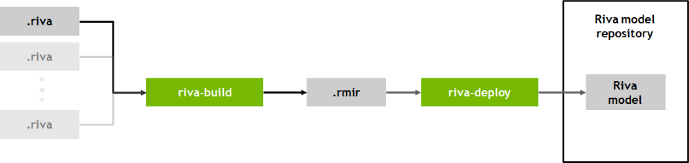

.. _riva_service_maker:

Riva - ServiceMaker
===================

    
After exporting the models using TAO or Nemo, *Riva ServiceMaker* could be used to deploy exported models in Riva server. 

.. note::

    See :ref:`riva_custom_model_intro` for more details of exporting custom AI models in :file:`.riva` formats for deployment.

riva-build
----------
:code:`riva-build` tool takes 1 or more :file:`.riva` models as input and outputs a :code:`.rmir` (intermediate format) file.

Syntax of :code:`riva-build`

.. code-block:: bash

    riva-build <task-name> --decoder_type=<decoder> output-dir-for-rmir/model.rmir:key dir-for-riva/model.riva:key

.. list-table:: Currently supported tasks (Riva services) by riva-build tool
    :widths: 25 105
    :header-rows: 1

    * - Tasks
      - Corresponding services
    * - :code:`speech_recognition`
      - ASR
    * - :code:`speech_synthesis`
      - TTS
    * - :code:`qa`
      - Question answering
    * - :code:`token_classification`
      - Token level classification
    * - :code:`intent_slot`
      - Joint intent
    * - :code:`text_classification`
      - \-
    * - :code:`punctuation`
      - \-

.. note::
  
	See `Riva Build <https://docs.nvidia.com/deeplearning/riva/user-guide/docs/model-overview.html#riva-build>`_ for more details.

riva-deploy
-----------
:code:`riva-deploy` tool takes 1 or more :file:`.rmir` files and a Riva model repo as inputs.

Syntax of :code:`riva-deploy`

.. code-block:: bash

    riva-deploy /servicemaker-dev/<rmir_filename>:<encryption_key> /data/models

.. note::

	See `Riva Deploy <https://docs.nvidia.com/deeplearning/riva/user-guide/docs/model-overview.html#riva-deploy>`_ for more details.
