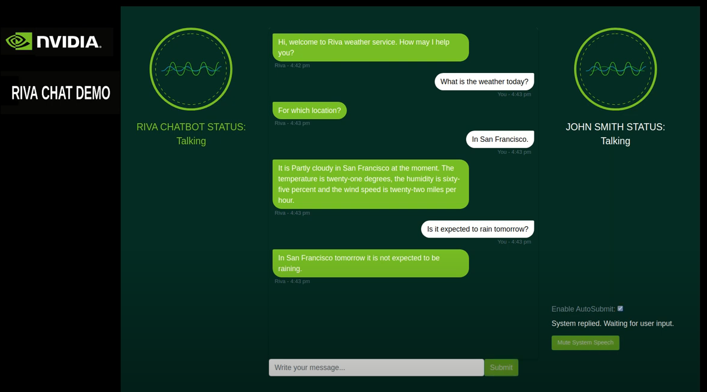

Riva - Virtual Assistant 
========================
This sample implementation of conversational AI describes how to build Virtual Assistant using NGC sample image.

To see more details, click 

* `Riva - Sample Virtual Assistant <https://docs.nvidia.com/deeplearning/riva/user-guide/docs/samples/weather.html>`_

Start Riva services
-------------------
Follow :ref:`riva_start_guide` and start Riva services

.. code-block::

    bash riva_start.sh

Download sample image
---------------------
Make sure your NGC API is configured before pulling the sample image

.. code-block::

    docker pull nvcr.io/nvidia/riva/riva-speech-client:1.4.0-beta-samples

Run Riva service
----------------
First we create a container from the sample image we just pulled from NGC.

.. code-block::

    docker run  -it --rm -p 8009:8009 nvcr.io/nvidia/riva/riva-speech-client:1.4.0-beta-samples /bin/bash

Edit :code:`riva_config` in :code:`samples/virtual-assistant/config.py`:

.. code-block::

    riva_config = {
        "RIVA_SPEECH_API_URL": "<riva-host-ip>:50051", 
        "ENABLE_QA": "QA unavailable in this VA version. Coming soon",
        "WEATHERSTACK_ACCESS_KEY": "<weather-api-key>",
        "VERBOSE": True  # print logs/details for diagnostics
    }

* :code:`RIVA_SPEECH_API_URL`: Replace the IP & port with your hosted Riva endpoint
* :code:`WEATHERSTACK_ACCESS_KEY`: Get your access key at `here <https://weatherstack.com/>`_

Start Virtual Assistant app
---------------------------
After configuring :code:`config.py`, we can now start the web application of Virtual Assistant.

.. code-block:: python

    python3 main.py

Visit *https://<riva-host-ip>:8009/rivaWeather* to use Virtual Assistant.