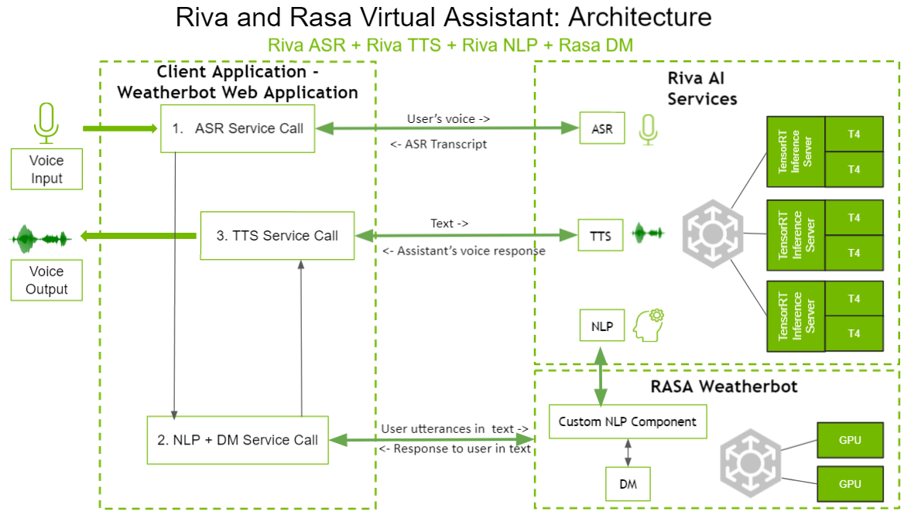
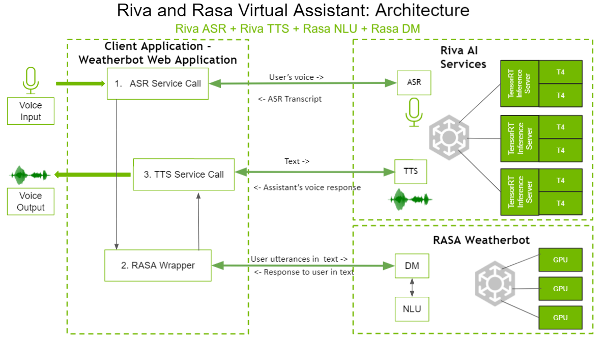

Riva - Virtual Assistant - Rasa
===============================

This sample implementation of conversational AI describes how to build Virtual Assistant with `Rasa <https://rasa.com/>`_ dialogue manager hosted.

Option 1: Riva ASR + Riva TTS + Riva NLP + Rasa dialog manager

Option 2: Riva ASR + Riva TTS + Rasa NLU + Rasa dialog manager

Overview of RVA Rasa
--------------------

.. code-block::

    .
    |-- README.md
    |-- config.py
    |-- rasa-riva-weatherbot-webapp
    |   |-- client
    |   |   `-- webapplication
    |   |       |-- cert.pem
    |   |       |-- key.pem
    |   |       |-- server
    |   |       |   |-- __init__.py
    |   |       |   `-- server.py
    |   |       |-- start_web_application.py
    |   |       `-- ui
    |   |           |-- README.md
    |   |           |-- img
    |   |           |   |-- Rivadm.png
    |   |           |   `-- User.png
    |   |           |-- index.html
    |   |           |-- script.js
    |   |           |-- static
    |   |           |   |-- stylesheets
    |   |           |   |   `-- index.css
    |   |           |   `-- svg_files
    |   |           |       |-- another_sample.svg
    |   |           |       |-- circle.svg
    |   |           |       |-- logo.svg
    |   |           |       |-- logo_sample.svg
    |   |           |       |-- nv_logo.svg
    |   |           |       |-- nv_logo_1.svg
    |   |           |       |-- nvidia_logo.svg
    |   |           |       |-- nvidia_name.svg
    |   |           |       |-- riva_name.png
    |   |           |       |-- sample_.svg
    |   |           |       |-- speech.svg
    |   |           |       `-- speech_logo.svg
    |   |           `-- style.css
    |   |-- main.py
    |   `-- riva
    |       |-- __init__.py
    |       |-- asr
    |       |   |-- __init__.py
    |       |   `-- asr.py
    |       |-- chatbot
    |       |   |-- __init__.py
    |       |   |-- chatbot.py
    |       |   `-- chatbots_multiconversations_management.py
    |       |-- rasa
    |       |   |-- __init__.py
    |       |   `-- rasa.py
    |       `-- tts
    |           |-- __init__.py
    |           |-- tts.py
    |           `-- tts_stream.py
    `-- rasa-weatherbot
        |-- __init__.py
        |-- __pycache__
        |   |-- __init__.cpython-37.pyc
        |   `-- actions.cpython-37.pyc
        |-- actions
        |   |-- __init__.py
        |   |-- actions.py
        |   `-- weather.py
        |-- components.py
        |-- config
        |   |-- config_rasanlp.yml
        |   `-- config_rivanlp.yml
        |-- data
        |   |-- nlu_rasanlp.yml
        |   |-- nlu_rivanlp.yml
        |   |-- rules_rasanlp.yml
        |   |-- rules_rivanlp.yml
        |   |-- stories_rasanlp.yml
        |   `-- stories_rivanlp.yml
        |-- domain
        |   |-- domain_rasanlp.yml
        |   `-- domain_rivanlp.yml
        |-- endpoints.yml
        |-- riva
        |   |-- __init__.py
        |   `-- nlp
        |       |-- __init__.py
        |       `-- nlp.py
        `-- tests
            `-- conversation_tests.md

Prerequisites
-------------

1. Pull Riva Sample container

.. code-block:: bash

    docker pull nvcr.io/nvidia/riva/riva-speech-client:1.5.0-beta-samples

2. Prepare network configuration files

Create a Riva config :file:`config.py`, and replace :code:`RASA_API_URL` with the local machine ip you use to host Rasa server.

.. warning::

    Please use local machine ip (not :code:`0.0.0.0`/ :code:`127.0.0.1`/ :code:`localhost`)

.. code-block:: python

    # ==============================================================================
    # Copyright (c) 2020, NVIDIA CORPORATION. All rights reserved.
    #
    # The License information can be found under the "License" section of the
    # README.md file.
    # ==============================================================================

    client_config = {
        "CLIENT_APPLICATION": "WEBAPPLICATION", # Default and only config value for this version
        "PORT": 5555, # The port your flask app will be hosted at
        "DEBUG": False, # When this flag is set, the UI displays detailed riva data
        "VERBOSE": True  # print logs/details for diagnostics
    }

    riva_config = {
        "RIVA_SPEECH_API_URL": "0.0.0.0:50051", # Replace the IP port with your hosted RIVA endpoint
        "WEATHERSTACK_ACCESS_KEY": "8a82ce50a069bfaaa3db4427ecca723d",  # Get your access key at - https://weatherstack.com/
        "VERBOSE": True  # print logs/details for diagnostics
    }

    rasa_config = {
        "VERBOSE": False, # Print logs/details for diagnostics
        "RASA_API_URL": "http://<rasa-host-ip>:5005", # Replace the IP & Port with the rasa-weatherbot's IP & Port
    }

    asr_config = {
        "VERBOSE": False, # Print logs/details for diagnostics
        "SAMPLING_RATE": 16000, # The Sampling Rate for the audio input file. The only value currently supported is 16000
        "LANGUAGE_CODE": "en-US", # The language code as a BCP-47 language tag. The only value currently supported is "en-US"
        "ENABLE_AUTOMATIC_PUNCTUATION": True, # Enable or Disable punctuation in the transcript generated. The only value currently supported by the chatbot is True (Although Riva ASR supports both True & False)
    }

    tts_config = {
        "VERBOSE": True, # Print logs/details for diagnostics
        "SAMPLE_RATE": 22050, # The speech is generated at this sampling rate. The only value currently supported is 22050
        "LANGUAGE_CODE": "en-US", # The language code as a BCP-47 language tag. The only value currently supported is "en-US"
        "VOICE_NAME": "ljspeech", # The voice name for the speech generated. The only value currently supported is "ljspeech"
    }

    rivanlp_config = {
        "VERBOSE": False, # Print logs/details for diagnostics
        "NLU_FALLBACK_THRESHOLD": 0.3 # When Intent's confidence/score is less than this value, intent is set to nlu_fallback
    }

Create a Riva config :file:`endpoints.yml`

.. code-block:: bash

    # ==============================================================================
    # Copyright (c) 2020, NVIDIA CORPORATION. All rights reserved.
    #
    # The License information can be found under the "License" section of the
    # README.md file.
    # ==============================================================================

    # This file contains the different endpoints your bot can use.

    # Server where the models are pulled from.
    # https://rasa.com/docs/rasa/user-guide/configuring-http-api/#fetching-models-from-a-server/

    #models:
    #  url: http://my-server.com/models/default_core@latest
    #  wait_time_between_pulls:  10   # [optional](default: 100)

    # Server which runs your custom actions.
    # https://rasa.com/docs/rasa/core/actions/#custom-actions/

    action_endpoint:
        url: "http://0.0.0.0:5055/webhook"
    # Tracker store which is used to store the conversations.
    # By default the conversations are stored in memory.
    # https://rasa.com/docs/rasa/api/tracker-stores/

    #tracker_store:
    #    type: redis
    #    url: <host of the redis instance, e.g. localhost>
    #    port: <port of your redis instance, usually 6379>
    #    db: <number of your database within redis, e.g. 0>
    #    password: <password used for authentication>
    #    use_ssl: <whether or not the communication is encrypted, default false>

    #tracker_store:
    #    type: mongod
    #    url: <url to your mongo instance, e.g. mongodb://localhost:27017>
    #    db: <name of the db within your mongo instance, e.g. rasa>
    #    username: <username used for authentication>
    #    password: <password used for authentication>

    # Event broker which all conversation events should be streamed to.
    # https://rasa.com/docs/rasa/api/event-brokers/

    #event_broker:
    #  url: localhost
    #  username: username
    #  password: password
    #  queue: queue

3. Create a local dir :code:`cfg_dir` and store :file:`config.py` and :file:`endpoints.yml` to :code:`cfg_dir`

1. Start Riva Server
--------------------

Follow :ref:`riva_start_guide` to start enable Riva services.

2. Start Rasa Action Server
---------------------------

2.1 Create Riva Sample container

.. code-block:: bash

    docker run -it --rm -p 5055:5055 -v $(pwd)/cfg_dir:/workspace/cfg nvcr.io/nvidia/riva/riva-speech-client:1.5.0-beta-samples /bin/bash

2.2 Replace :code:`/workspace/samples/virtual-assistant-rasa/config.py` with :code:`/workspace/cfg_dir/config.py`

2.3 Replace :code:`/workspace/samples/virtual-assistant-rasa/rasa-weatherbot/endpoints.yml` with :code:`/workspace/cfg_dir/endpoints.yml`

2.4 Activate the Rasa Python environment

.. code-block:: bash

    . /pythonenvs/rasa/bin/activate

2.5 Navigate to the :code:`/workspace/samples/virtual-assistant-rasa/rasa-weatherbot` directory and Start Rasa Action server

.. code-block:: bash

    cd /workspace/samples/virtual-assistant-rasa/rasa-weatherbot
    rasa run actions --actions actions

3. Start Rasa Server
--------------------

Open another terminal and create Riva sample container

3.1 Create Riva Sample container

.. code-block::

    sudo docker run -it --rm -p 5005:5005 -v $(pwd)/cfg_dir:/workspace/cfg nvcr.io/nvidia/riva/riva-speech-client:1.5.0-beta-samples /bin/bash

3.2 Replace :code:`/workspace/samples/virtual-assistant-rasa/config.py` with :code:`/workspace/cfg_dir/config.py`

3.3 Replace :code:`/workspace/samples/virtual-assistant-rasa/rasa-weatherbot/endpoints.yml` with :code:`/workspace/cfg_dir/endpoints.yml`

3.4 Activate the Rasa Python environment.

.. code-block:: bash

    . /pythonenvs/rasa/bin/activate

3.5 Navigate to the :code:`/workspace/samples/virtual-assistant-rasa/rasa-weatherbot` directory and Run the Rasa training

.. code-block:: bash

    cd /workspace/samples/virtual-assistant-rasa/rasa-weatherbot

If you use Riva NLP:

.. code-block:: bash

    rasa train -c config/config_rivanlp.yml \
        -d domain/domain_rivanlp.yml \
        --out models/models_rivanlp/ \
        --data data/nlu_rivanlp.yml \
        data/rules_rivanlp.yml \
        data/stories_rivanlp.yml

Or you use Rasa NLU:

.. code-block:: bash

    rasa train -c config/config_rasanlp.yml \
        -d domain/domain_rasanlp.yml \
        --out models/models_rasanlp/ \
        --data data/nlu_rasanlp.yml \
        data/rules_rasanlp.yml data/stories_rasanlp.yml

3.6 Start the Rasa Server

* If you use Riva NLP:
  
.. code-block::

    rasa run -m models/models_rivanlp/ --enable-api \
        --log-file out.log --endpoints endpoints.yml

* If you use Rasa NLU:

.. code-block::

    rasa run -m models/models_rasanlp/ --enable-api \
        --log-file out.log --endpoints endpoints.yml

4. Start RVA Rasa Server
------------------------

4.1 Create Riva Sample container

.. code-block::

    sudo docker run -it --rm -p 5555:5555 -v $(pwd)/cfg_dir:/workspace/cfg nvcr.io/nvidia/riva/riva-speech-client:1.5.0-beta-samples /bin/bash

4.2 Replace :code:`/workspace/samples/virtual-assistant-rasa/config.py` with :code:`/workspace/cfg_dir/config.py`

4.3 Replace :code:`/workspace/samples/virtual-assistant-rasa/rasa-weatherbot/endpoints.yml` with :code:`/workspace/cfg_dir/endpoints.yml`

4.4 Activate Chatbot Python environment

.. code-block:: bash

    . /pythonenvs/client/bin/activate

4.5 Navigate to the :code:`/workspace/samples/virtual-assistant-rasa/rasa-riva-weatherbot-webapp` directory and Start Chatbot Client server

.. code-block:: bash

    python3 main.py

5. Open RVA Rasa
-----------------

Browse *https\:\/\/\[riva chatbot server host IP\]:5555/rivaWeather*.